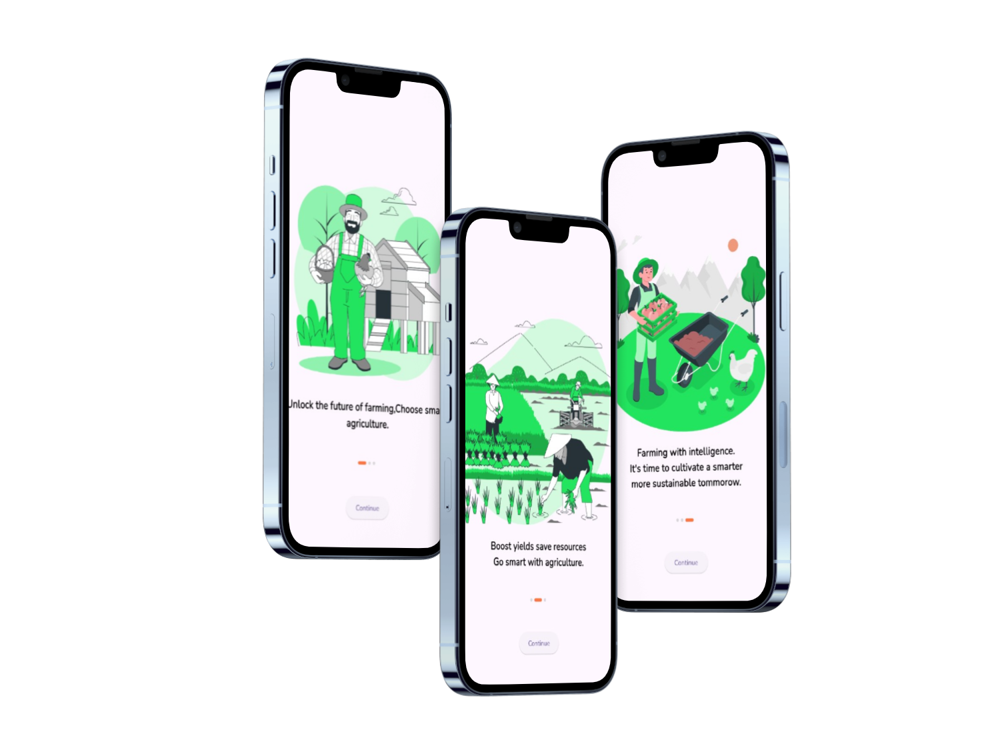
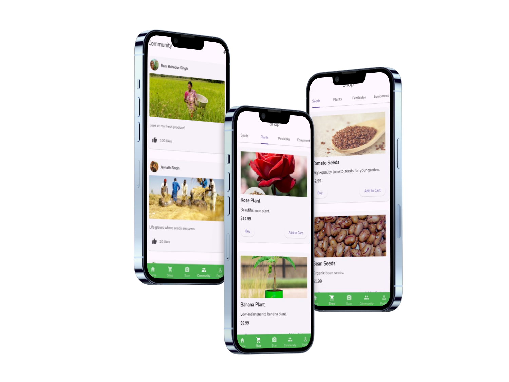

# Vasudhara: A Smart Farming Method


## Overview

**Vasudhara: A Smart Farming Method** is a cutting-edge mobile application designed to enhance farming techniques using modern technology. This app provides farmers with essential tools and information to make informed decisions, increase productivity, and promote sustainable farming practices.

## Features

- **User-Friendly Interface**: Utilizes Fluent UI for a sleek and intuitive design.
- **Interactive Charts**: Visualize farming data using Syncfusion Flutter Charts.
- **Geolocation Services**: Track and manage farm locations with Geolocator.
- **AI Integration**: Access AI-driven insights with Google Generative AI.
- **Real-Time Chat**: Communicate with experts using Dash Chat 2.
- **Custom Icons**: Incorporates Cupertino Icons for iOS-style design elements.
- **Custom Fonts**: Enhanced text appearance with Google Fonts.
- **Environment Configuration**: Manage configurations securely with Flutter Dotenv.
- **Network Requests**: Fetch data from the internet using HTTP.
- **Cross-Platform Launcher Icons**: Custom app icons for various platforms with Flutter Launcher Icons.
- **State Management**: Efficient state management with Provider.

## Installation

1. Ensure you have Flutter installed. For installation instructions, visit [Flutter's official website](https://flutter.dev).
2. Clone the repository:
    ```sh
    git clone https://github.com/yourusername/vasudhara_smart_farming.git
    ```
3. Navigate to the project directory:
    ```sh
    cd vasudhara_smart_farming
    ```
4. Install dependencies:
    ```sh
    flutter pub get
    ```
5. Run the application:
    ```sh
    flutter run
    ```

## Configuration

Make sure to add your environment variables in the `.env` file located in the root directory.

## Dependencies

Below is the list of major dependencies used in this project:

- **cupertino_icons**: ^1.0.2
- **fluent_ui**: ^4.8.6
- **flutter_svg**: ^2.0.10+1
- **google_generative_ai**: ^0.2.2
- **dash_chat_2**: ^0.0.20
- **http**: ^1.2.1
- **flutter_dotenv**: ^5.1.0
- **baseflow_plugin_template**: ^2.1.2
- **geolocator**: ^11.0.0
- **syncfusion_flutter_charts**: ^25.2.5
- **flutter_launcher_icons**: ^0.13.1
- **provider**: ^6.1.2
- **google_fonts**: ^6.2.1

## Assets

- **Images**: `assets/images/`
- **Icons**: `assets/icons/`
- **Logo**: `assets/logo/`
- **Machine Learning Models**: `assets/ml_model/`
- **Environment Config**: `.env`

## Screenshots

### Splash Screen


### Home Screen


### Onboarding Screen


### Chat Interface


### Media Screen


## Contributing

Contributions are welcome! Please fork this repository and submit a pull request for any enhancements, bug fixes, or new features.

## License

This project is licensed under the MIT License - see the [LICENSE](LICENSE) file for details.

## Contact

For any inquiries or support, please contact us at [support@vasudhara_farming.com](mailto:support@vasudhara_farming.com).

---

Thank you for using Vasudhara: A Smart Farming Method. We hope this app brings significant improvements to your farming practices!
